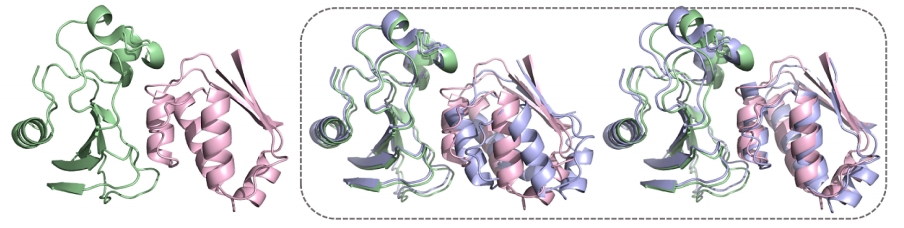
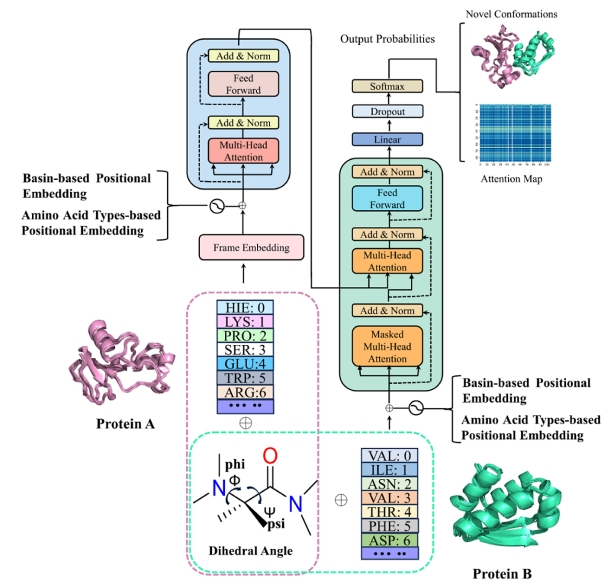

# AlphaPPIMd

> AlphaPPIMd 复现

## Overview

AlphaPPImd 是一种用于探索蛋白质-蛋白质复合物构象空间的 **基于 Transformer 的生成模型**，旨在补充传统分子动力学（MD）模拟中采样效率低、计算成本高的问题。通过学习 MD 轨迹的构象分布，AlphaPPImd 可生成物理合理的新构象，实现对蛋白-蛋白相互作用动态机制的建模与拓展。

## 算法概述

#### 解决的问题

传统的 MD 模拟虽能生成高分辨率的蛋白质构象，但存在计算成本高、难以探索稀有或长时间尺度构象的瓶颈。AlphaPPImd 通过深度生成模型在学习已有轨迹的基础上：

- **生成未采样的构象**，丰富蛋白质复合物的构象空间；
- **识别关键残基对**，提供蛋白-蛋白结合的机制解释；
- **扩展模拟时间尺度**，辅助药物设计与蛋白工程研究。

#### 算法架构

### 🔹输入（Input）

- 预处理后的蛋白质-蛋白质复合物 MD 轨迹序列（以 basin 编码的 $\phi$, $\psi$ 二面角序列表示）
- 蛋白质序列中的氨基酸类型（用于类型嵌入）
- 训练或推理模式下的填充标记（如 `target_front_pad`, `train_end_pad`）

### 🔹 输出（Output）

- 生成的蛋白质-蛋白质复合物构象序列（预测下一个时间帧的 basin 编码）
- 可进一步通过 Modeller 还原为三维结构模型
- 注意力权重矩阵（用于识别关键残基对）

### 🔹 模型结构

- **嵌入层（PosEmbedding）**：融合 token、位置和氨基酸类型信息
- **Transformer 编码器**：对输入序列建模提取上下文表示
- **Transformer 解码器**：利用自回归和交叉注意力机制预测下一个构象帧
- **输出层**：对每个位置预测 basin 编号（即下一个时间帧的 $\phi$, $\psi$ 状态）

##  数据处理关键过程（Key Data Processing Steps）

1. **获取蛋白-蛋白复合物的晶体结构**
2. **构建 MD 模拟系统**
   - 使用AmberTools、OpenMM工具模拟蛋白质在环境中的复合过程，获得轨迹序列
3. **提取蛋白主链扭转角（$\phi$, $\psi$）**
   - 对每一帧，提取 backbone 的$\phi$和$\psi$二面角，用于反映残基构象；
4. **Ramachandran 分区（basin 编码）**
   - 使用 KMeans 聚类将所有ϕ, ψ 对映射到 **4 个 basin 区域**（编号为 0–3）；
   - 将每帧的二面角序列编码为一个 basin 字符串（如 `[0,1,3,2,...]`），作为训练样本。
5. **添加前后填充标记（Padding）**
   - 填充后序列统一长度，便于批处理训练。
6. **氨基酸类型嵌入编码**
   - 将蛋白质主序列中的氨基酸（如 A、V、L、E 等）映射为整数类型（0–21）；
   - 与 basin 编码一一对应，用于构造类型嵌入（type embedding）。
7. **构建输入张量**
   - 将 basin 编码序列、类型序列和位置编码融合为 Transformer 输入，供模型训练与生成使用。
